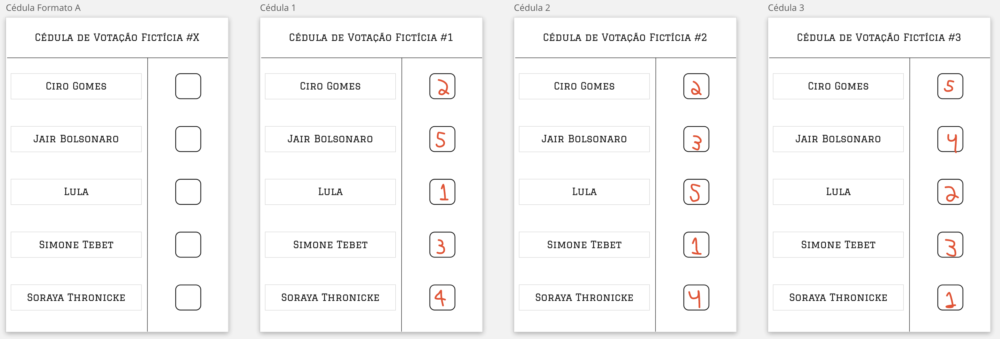
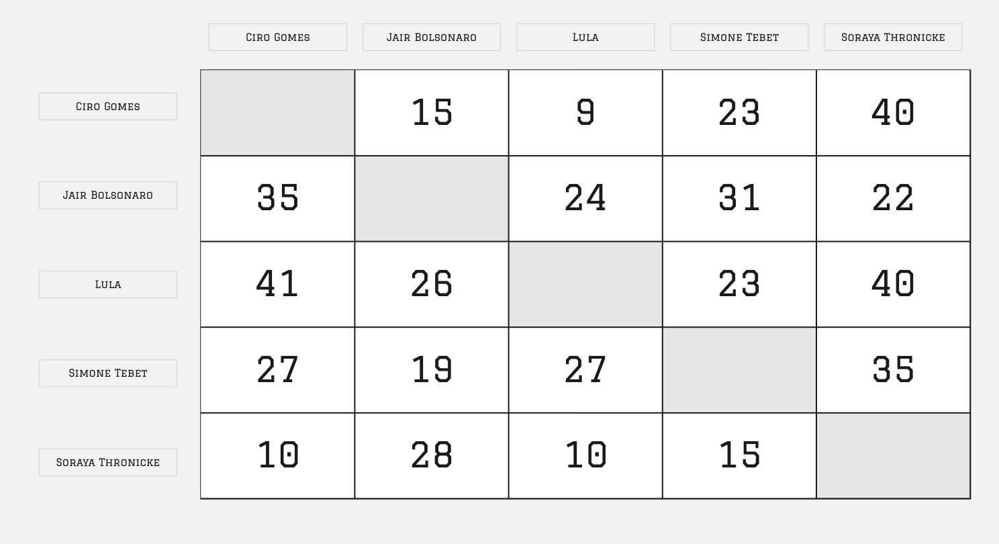
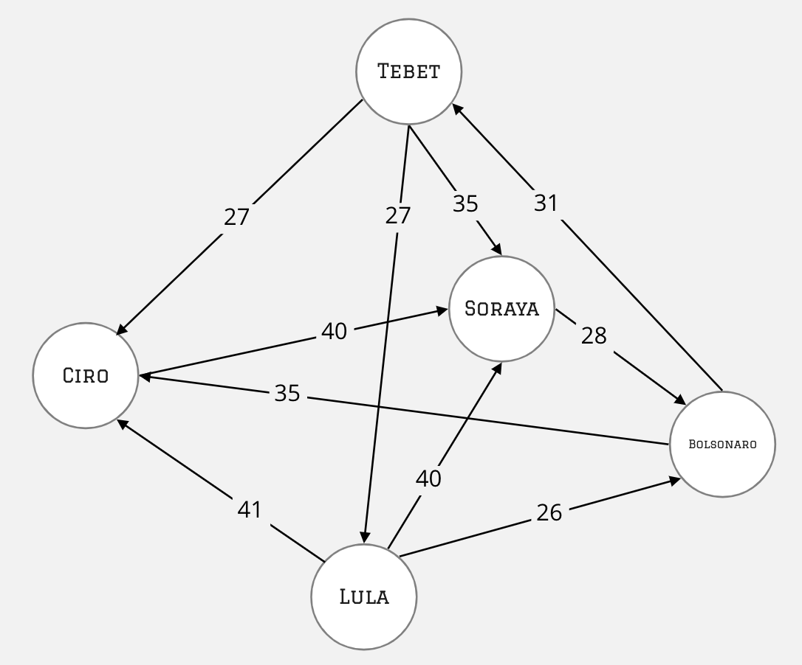
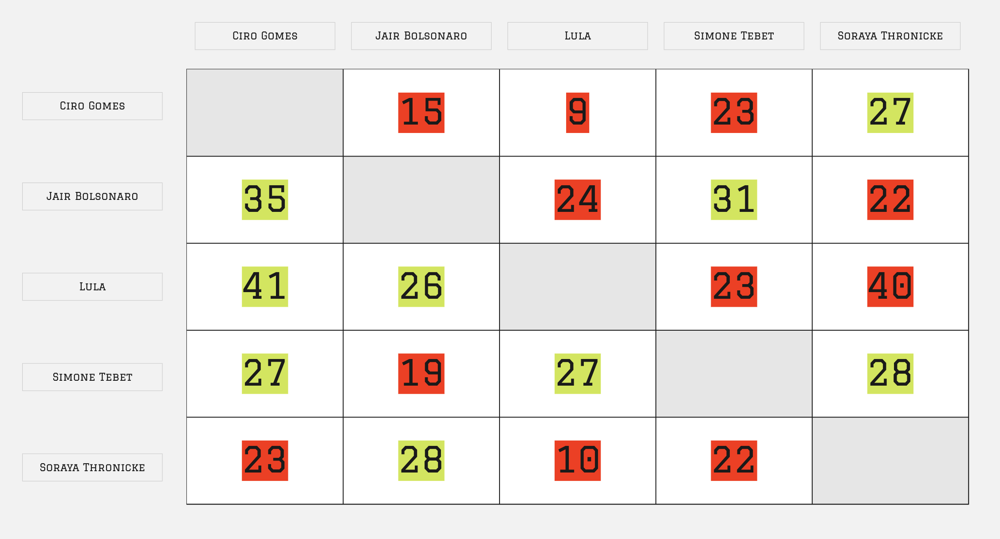

# O Problema

> Temática: Grafos acíclicos direcionados (_DAG_), relacionados à pesquisa do autor com modelos causais que também são _DAG_

Existem diversas organizações, coletivos, federações, e outros orgãos coletivos que possuem representantes eleitos por votação. O nosso próprio país é um desses exemplos, e está, no momento da elaboração desse trabalho, no meio de um desses processos eleitorais. Não existe somente uma maneira de realizar eleições, podendo ter métodos variados com diferentes critérios.

Um desses métodos é conhecido como o <b>Método Schulze</b>, desenvolvido em 1997 por Markus Schulze, que seleciona um vencedor único usando votos de preferências, ou uma seleção ordenada de vencedores. Existem outros nomes para esse método como _Schwartz Sequential Dropping (SSD)_, _Beatpath Method_, _Path Winner_, entre outros. O método escolhe um vencedor que é preferido por uma maioria sobre todos os outros em uma comparação por pares.

O Método Schulze é utilizado por diversas organizações como Ubuntu, Debian, Gentoo, a cidade de Turin - Itália, e o distrito de Southwark em Londres.


## A Cédula de Votação
Nesse método de votação, ao invés de cada eleitor escolher um candidato em uma seleção de $N$ candidatos, o eleitor ordena uma subseleção com $M$ desses candidatos, do que mais prefere para o que menos prefere, como mostra o modelo e exemplos abaixo.

<center>
    
</center>


## Modelagem
A partir de votos como esse, é possível então contabilizar quantos eleitores preferem um candidato $A$ a um candidato $B$. Seguindo o exemplo da imagem acima, comparando `Ciro Gomes` com `Simone Tebet`, podemos ver que `Ciro` está melhor rankeado na cédula 1, enquanto `Tebet` está melhor nas cédulas 2 e 3. Podemos dizer, então, que `Ciro` possui 1 cédula em sua vantagem na comparação com `Simone`, que por sua vez tem 2 cédulas em vantagem em relação a `Ciro`.

Supondo que existam mais cédulas, como 50, e analisar caso a caso, é possível então montar uma matriz como a abaixo, onde cada célula informa qual a quantidade de cédulas que possui o candidato na linha $i$ em relação ao candidato na coluna $j$.

<center>
    
</center>

Essa matriz, poderia ser representado por um grafo $G = (V,E)$ onde $V$ são os vértices com os candidatos e $E$ as arestas direcionados com o peso da quantidade de cédulas preferindo um candidato $A$ em detrimento de um $B$.

<center>
    
</center>

## Caminho mais _forte_
A partir do grafo é possível ter caminhos diferentes entre dois candidatos $A$ e $B$. A **força de um caminho** é determinado pelo seu link mais fraco, ou seja, o menor valor de aresta no caminho. 

Por exemplo, considere os caminhos `Tebet` -> `Soraya`. Temos um caminho `Tebet - Lula - Soraya` que possui valores de arestas, respectivas, `1 - 2`. Também tem um caminho `Tebet - Ciro - Soraya`, com arestas `6 - 9`. No primeiro caso, a **força do caminho** é 1, pois é $1$ o menor valor no caminho. No segundo caso, é $6$.

## Determinando o(s) vencedor(es)
A partir do cálculo do caminho mais forte, podemos ter uma nova matriz $P$ calculada, com o caminho mais forte entre todos os pares de candidatos. 

<center>
    
</center>

Agora a saída do método de Schulze pode ser determinada. Por exemplo, comparando `Bolsonaro` com `Tebet`, temos que `Bolsonaro > Tebet`, visto que $P[$`Bolsonaro`$][$`Tebet`$] = 31 > P[$`Tebet`$][$`Bolsonaro`$] = 19$. A imagem mostra de forma colorida em verde quem venceu o embate individual, e vermelho quem o perdeu.

Comparando os vencedores dos embates individuais é possível então determinar que `Lula` $>$ `Tebet` $>$ `Ciro` $>$ `Bolsonaro` $>$ `Soraya`.
> Existem situações que podem ocasionar empate e que podem ser tratados. Entretanto, para simplificar, não o trataremos nesse trabalho, ignorando os empates e a interpretação do resultado em si.

> Para mais detalhes do problema, veja [esse vídeo do YouTube](https://www.youtube.com/watch?v=_HVeN0GnnuA).

<hr/>

# Algoritmo
Dado uma entrada $X$, sendo $X$ uma matriz quadrada de dimensão $C$ (sendo $C$ o número de candidatos participantes), e $X[i,j]$ o número de votantes que prefere o candidato `i` ao candidato `j`, o algoritmo retorna uma saída $F$ que é uma matriz quadrada de dimensão $C$ onde $C[i,j]$ é a força do caminho mais forte entre o candidato `i` e candidato `j`.

Esse algoritmo é uma versão adaptada do **algoritmo de _Floyd-Warshall_**, que calcula o caminho mais curto (ou mais longo) entre todos os pares de vértices em um grafo direcionado.

## Funções Auxiliares
Funções triviais de mínimo e máximo foram implementadas e utilizadas. Ambas possui complexidade $\Theta(1)$, por se tratar de uma única comparação realizada.
```rust
fn max(a: i32, b: i32) -> i32 { return if a > b { a } else { b }; }
fn min(a: i32, b: i32) -> i32 { return if a < b { a } else { b }; }
```


## Pré-Etapa: Cleansing
A primeira etapa do algoritmo é a de limpeza de arestas que possui uma aresta de sentido sentido oposto mas com um valor maior. Essa etapa é apenas uma preparação do algoritmo em si, não sendo considerada para a análise. Sua complexidade é $\Theta(n^2)$ onde $n$ é o número de candidatos, ou o número de nós do grafo, uma vez que o grafo está sendo representado como uma matriz de arestas, e portanto, se tratando de um array bidimensional, precisa ser percorrido em todas as suas posições.

```rust
pub fn prepare_graph(graph: &Vec<Vec<i32>>) -> Vec<Vec<i32>> {
    let contestants_amount: usize = (*graph).len();
    let mut strong_links: Vec<Vec<i32>> = vec![vec![0; contestants_amount]; contestants_amount];

    for i in 0..contestants_amount {
        for j in 0..contestants_amount {
            if i == j { continue; }

            if *graph[i][j] > *graph[j][i] {
                strong_links[i][j] = *graph[i][j];
            }
        }
    }

    return strong_links;
}
```


## Tamanho da Entrada
Conforme descrito nas seções acima, o algoritmo possui uma matriz de arestas como estrutura de dado para cada par de vértices do grafo. Dessa maneira, a matriz será uma matriz quadrada de dimensão $N x N$ onde $N$ é a quantidade de candidatos no processo. 

## Versão Iterativa
A versão iterativa do algoritmo faz com que o grafo de resultados preparado seja percorrido a cada $C$ vezes a cada célula buscando o caminho mais forte.

```rust
pub fn schulze_iterative(graph: &Vec<Vec<i32>>) -> Vec<Vec<i32>> {
    let contestants_amount: usize = (*graph).len();
    let mut strong_links: Vec<Vec<i32>> = prepare_graph(graph);

    for i in 0..contestants_amount {
        for j in 0..contestants_amount {
            if i == j { continue; }

            for k in 0..contestants_amount {
                if !(i != k && j != k) { continue; }

                let weakest_edge = min(strong_links[j][i], strong_links[i][k]);
                let strength = max(strong_links[j][k], weakest_edge);

                strong_links[j][k] = strength;
            }
        }
    }

    return strong_links;
}
```

### Análise de Complexidade de Tempo
A eficência de tempo é analisada determinando o número de repetições da **operação básica** como uma função do tamanho da entrada: $T(n) \approx C_{op}C(n)$ onde $T(n)$ é o tempo de execução, $n$ o tamanho da entrada, $C_{op}$ o tempo de execução da operação básica e $C(n)$ o número de vezes que a operação básica é executada.

A operação básica do algoritmo é a **comparação entre dois números inteiros**. Ou seja, $C_{op} = C_{comp}$ que representa o custo dessa comparação.<br/>
O número de vezes que a operação básica é executada depende do tamanho da entrada, visto que existe _loops_ que executam o "_tamanho da entrada vezes_" contendo a operação básica em seu corpo. <br/>
A operação básica é executada 4 vezes a cada iteração, em todos os cenários, não possuindo uma diferença de melhor caso, pior caso e caso médio. As comparações são realizadas no primeiro if do corpo do loop mais interno e uma vez cada nas funções de `min` e `max`.

Temos então que $C(n) = \sum_{i=0}^{n-1}\sum_{j=0}^{n-1}\sum_{k=0}^{n-1}4$

$C(n) = 4\sum_{i=0}^{n-1}\sum_{j=0}^{n-1}\sum_{k=0}^{n-1}1 = 4\sum_{i=0}^{n-1}\sum_{j=0}^{n-1}n = 4\sum_{i=0}^{n-1}(n)(n) = 4(n)(n)(n)$ 

$C(n) = 4n^{3}$ 

Logo, temos que: \
$T(n) \approx 4\ C_{comp}\ n^{3}$

#### Big-O
Essa função $T(n) \in O(g(n))$ se é limitada superiormente por uma constante múltipla de $g(n)$ para todos $n$ suficientemente grande. Portanto, vamos provar formalmente que $T(n) \in O(n^{3})$. Como $T(n) = C(n)*C_{comp}$ onde $C_{comp}$ é uma constante, ignoraremos a parte da constante.

$t(n) \leq cg(n)$ para todos $n \geq n_{0}$ \
Pegando $c = 5$ e $n_{0} = 1$, podemos afirmar que:

$4n^{3} \leq 5n^{3}$ para todo $n \geq 1$

O algoritmo portanto é $O(n^{3})$

#### Omega
Essa função $T(n) \in \Omega(g(n))$ se é limitada inferiormente por uma constante múltipla de $g(n)$ para todos $n$ suficientemente grande. Portanto, vamos provar formalmente que $T(n) \in \Omega(n^{3})$. Novamente, ignoraremos a parte da constante do custo de comparação.

De forma similar, também podemos provar que $T(n) \in \Omega(n^{3})$
$t(n) \geq cg(n)$ para todos $n \geq n_{0}$ \
Pegando $c = 1$ e $n_{0} = 1$, podemos afirmar que:

$4n^{3} \geq n^{3}$ para todo $n \geq 1$

O algoritmo portanto é $\Omega(n^{3})$

#### Theta
A função $T(n) \in \Theta(g(n))$ se é limitada tanto inferiormente ou superiormente por contantes positivas mútiplas de $g(n)$ para todos $n$ suficientemente grande.

Temos então que: \
$c_{2}g(n) \leq t(n) \leq c_{1}g(n)$ para todos $n \geq n_{0}$ \
Pegando $c_{1} = 10$, $c_{2} = 2$ e $n_{0} = 1$, podemos afirmar que:

$2n^{3} \leq 4n^{3} \leq 10n^{3}$ para todo $n \geq 1$

O algoritmo portanto é $\Theta(n^{3})$

### Gráficos
As imagens baixo mostram o comportamento do algoritmo em benchmarks de execuções reais. Com a ajuda de uma função geradora de matrizes de entrada válidas, foi executado o algoritmo com entradas $E = \{2,4,6,10,15,20,30,50,75,100,125,150,175,200,250,300,400,500,600,700\}$. Foi adicionado um contador de comparações do loop mais interno e o tempo de execução dos laços.

Uma vez coletados, os dados foram plotados nos gráficos abaixo, em função da quantidade de comparações realizadas e do tempo em segundos. Duas outras equações de referência mostram que o comportamento está coerente com a análise feita, utilizando constantes arbitrárias.

<center style="background: white; width:100%;">
    
    
</center>

<br/><hr/><br/>


## Versão Recrusiva
Assim como a versão iterativa, o algoritmo recursivo faz com que o grafo de resultados preparado seja percorrido a cada $C$ vezes a cada célula buscando o caminho mais forte.

```rust
pub fn schulze_recursive_step(strong_links: &mut Vec<Vec<i32>>, j: usize, k: usize, i: usize) -> i32 {
    // Base Condition
    if i == 0 {
        return strong_links[j][k];
    }

    // Diagonal
    if k == j   {
        return 0;
    }

    let weakest_edge = min(schulze_recursive_step(strong_links, comparisons, j, i, i-1), schulze_recursive_step(strong_links, comparisons, i, k, i-1));
    let strength = max(schulze_recursive_step(strong_links, comparisons, j, k, i-1), weakest_edge);

    return strength;
}


/// Recursive version of Schulze algorithm.
pub fn schulze_recursive(graph: &Vec<Vec<i32>>) -> Vec<Vec<i32>> {
    let contestants_amount: usize = (*graph).len();
    let mut strong_links: Vec<Vec<i32>> = prepare_graph(graph);

    for a in (0..contestants_amount).rev() {
        for b in (0..contestants_amount).rev() {
            strong_links[a][b] = schulze_recursive_step(&mut strong_links, a, b, contestants_amount - 1);
        }
    }

    return strong_links;
}

```
### Análise de Complexidade de Tempo
Assim como na seção da versão iterativa, a operação básica é a comparação de dois inteiros. 
O tamanho da entrada, que é a quantidade de candidatos, é passsado como o último argumento da função, o `i`.


A relação de recorrência é dada abaixo:

&nbsp;&nbsp;$C(0) = 1$ \
&nbsp;&nbsp;$C(n) = 3 C(n - 1) + 3$ para n > 0\


#### Forwards Substitution
$C(0) = 1$ \
$C(1) = 3C(1-1) + 3 = 3(1) + 3 = 6$ \
$C(2) = 3C(2-1) + 3 = 3(6) + 3 = 21$ \
$C(3) = 3C(3-1) + 3 = 3(21) + 3 = 66$ \
$C(4) = 3C(4-1) + 3 = 3(66) + 3 = 201$ \
$C(5) = 3C(5-1) + 3 = 3(201) + 3 = 606$ \
$C(n) = \dfrac{15 \times 3^n - 9}{6}$
$C(n) = \dfrac{5 \times 3^n - 3}{2}$

#### Backwards Substitution
$C(n) = 3 \times C(n - 1) + 3$

$C(n-1) = 3 \times C(n-2) + 3$\
$C(n-2) = 3 \times C(n-3) + 3$\
$C(n-3) = 3 \times C(n-4) + 3$


$C(n) = 3 \times (3 \times C(n - 1) + 3) + 3$  \
$= 9 \times C(n-1) + 12$  \
$= 9 \times (3 \times C(n-2) + 3) + 12$  \
$= 27 \times C(n-2) + 39$  \
$= 27 \times (3 \times C(n-3) + 3) + 39$  \
$= 81 \times C(n-3) + 120$  \
...

$C(n) = 3^{k} \times C(n -k) + ?$ (Não consegui desenvolver)

#### Indução Matemática
Passo base: suponha que $C(n) = \dfrac{5 \times 3^n - 3}{2}$ seja uma fórmula válida para a recorrência definida pra $n = 1,2,3...n$. Ela também precisa ser válida para $k = n + 1$

$C(n+1) = 3 \times C(n) + 1$ ... (Relação de recorrência)

$= 3 \times (\dfrac{5 \times 3^n - 3}{2}) + 3$ ... (Hípotese de indução) 

$= 3 \times (\dfrac{5}{2} \times \dfrac{3^n}{2} - \dfrac{3}{2}) + 3 = (\dfrac{15 \times 3^{n}-9}{2}) + \dfrac{6}{2} = \dfrac{15 \times 3^{n} - 3}{2} = \dfrac{(5 \times 3) \times 3^{n}-3}{2} = \dfrac{5 \times 3^{n+1}-3}{2}$

Portanto, $C(N) = \dfrac{5\times 3^{n} - 3}{2}$ é uma fórmula fechada válida para a recorrência definida para qualquer $k \in \N$.

#### Por Limite
Comparando a complexidade do algoritmo com a classe de complexidade $3^{n}$ temos que 

$lim_{n \to \infty} \dfrac{t(n)}{g(n)}$

onde $t(n) = \dfrac{5\times 3^{n} - 3}{2}$ e $g(n) = 3^{n}$ 

$=> lim_{n \to \infty} \dfrac{\dfrac{5\times 3^{n} - 3}{2}}{3^n}$

$= 0.5 \lim_{n \to \infty} -3^{1-x}+5 = 0.5 (\lim_{n \to \infty} -3^{1-x} + \lim_{n \to \infty}5) = 0.5 ((0) + (5))$

$= \dfrac{5}{2}$


Por definição, se o resultado do limite é uma constante, implica que $t(n)$ possui a mesma ordem de crescimento de $g(n)$. Dessarte, $t(n) \in \Theta(n^3)$.


#### Teorema Mestre
O teorema mestre não pode ser aplicado pois ele só permite resolver recorrências da forma $T(n) = aT(n/b) + f(n)$ para $a > 0$ e $b > 1$. No caso de estudo, o algoritmo não tem a parte da divisão, sendo portanto $b = 1$, o que invalida a condição para aplicar o teorema.

### Gráficos
As imagens baixo mostram o comportamento do algoritmo em benchmarks de execuções reais, realizadas da mesma maneira que a versão iterativa. Foi executado o algoritmo com entradas $E = \{2,3,4,5...15\}$. 
Uma vez coletados, os dados foram plotados nos gráficos abaixo, em função da quantidade de comparações realizadas e do tempo em segundos. Duas outras equações de referência mostram que o comportamento está coerente com a análise feita, utilizando constantes arbitrárias.

<center style="background: white; width: 100%;">
    
    
</center>


<br/><hr/><br/>


 <script type="text/javascript" src="http://cdn.mathjax.org/mathjax/latest/MathJax.js?config=TeX-AMS-MML_HTMLorMML"></script>
<script type="text/x-mathjax-config">
    MathJax.Hub.Config({ tex2jax: {inlineMath: [['$', '$']]}, messageStyle: "none" });
</script>
